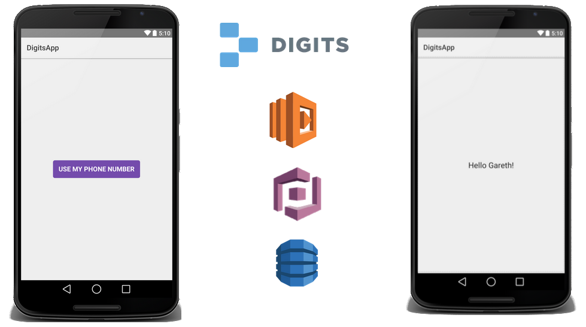
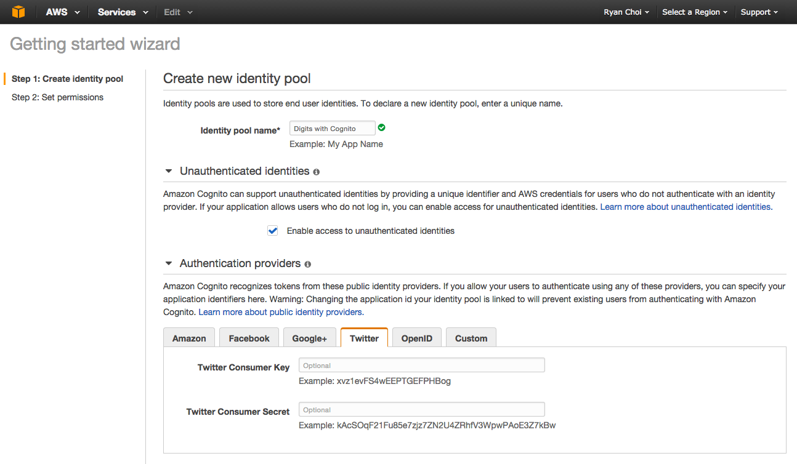
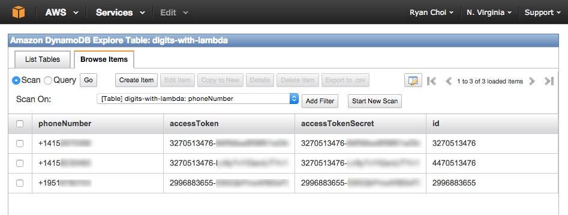
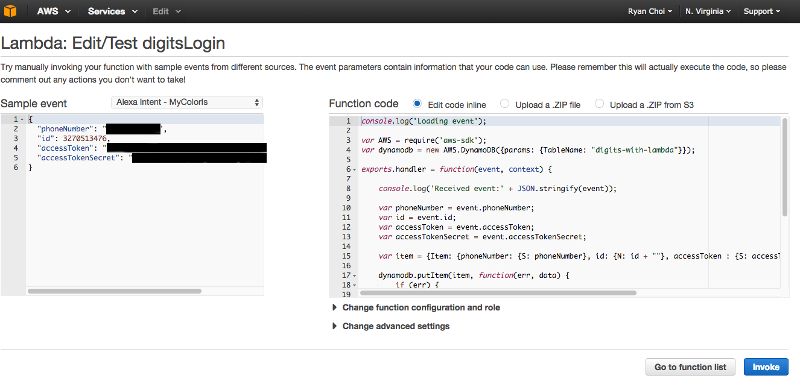

# Twitter Digits with Amazon Web Services

This sample code demonstrates using Twitter Digits to enable phone-based authentication, and using the AWS platform -- Cognito, Lambda and DynamoDB -- to provide simple and scalable back-end services for your mobile application.

Once you have this sample running, you can imagine other possible phone-based use cases, including:

- Deliver notifications or offers to user via Amazon SMS
- Connect with existing CRM solution to pre-populate user experience (Frequent Flyer status, Rewards memberships, etc.)
- Track in-app activity for personalization or A/B testing
- Protect against bot/spam abuse through phone verification

Requirements
---

The requirements needed to use this sample code are:

1. Download and install Android Studio (http://developer.android.com/tools/studio/index.html)
2. Download and install Fabric (https://fabric.io)
3. Amazon Web Services account (http://aws.amazon.com/)

Steps to run sample code
---

Follow the below steps to setup the Android App and the back-end AWS services:

1. Set up Digits for Android App (details below)
2. Set up AWS Cognito (details below)
3. Create an AWS Dynamo instance (details below)

As a final note, ensure that all AWS instances are located in US-East, so that they can make full use of Cognito and can connect to one another.

Setting up Digits/Getting token key & secret
---

1. Via Fabric, install the Digits Kit into your Android app
2. Log into your Fabric dashboard (https://fabric.io/dashboard)
3. Select your app from the top drop-down and then click on the Digits icon to the left
4. Your key/secret should appear on the page to the right

Once you have your token/secret, you want to add them into a properties file that the app reads. Copy the `app.properties.template` file into `app.properties` and add them under TWITTER_KEY and TWITTER_SECRET.

Setting up AWS Cognito/creating an identity pool
---

In order to get your access key and secret for the HTML example, follow the below instructions:

1. Log into the Amazon Cognito console (https://console.aws.amazon.com/cognito)
2. Click on "Create new Identity pool"
3. Specify a name for the pool and also specify your Twitter key/secret

Below is a screenshot of the identity pool creation page, for your reference:

You'll now want to add this into the `app.properties` file in the AWS_IDENTITY_POOL_ID property.

Create an AWS DynamoDB instance
---

To store and retrieve records on the server, the Lambda service connects to a DynamoDB instance. To easily create a store, follow the below instrutions:

1. Log into the Amazon DynamoDB console (https://console.aws.amazon.com/dynamodb)
2. Click on the "Create Table" button 
3. Specify the table name as "digits-with-lambda"
4. Specify the Primary Key Type as "Hash" with Hash Name as "phoneNumber" and String type

After your app is fully deployed and running, you can also view the saved entries via the "Explore Table" button on the DynamoDB console. You should see records that look like the following:

Create an AWS Lambda service
---

To create a scalable and simple Lambda service for this code, following the below steps:

1. Log into the Amazon Lambda console (https://console.aws.amazon.com/lambda)
2. Click on the "Create a Lambda function" button
3. Specify the Name as "digitsLogin"
4. Specify the Runtime to be Node.js
5. Copy the code from `lambda/server.js` into the code area on the page
6. Specify the Handler as "index.handler"
7. For Role, choose a "Basic with Dynamo" role (you may need to create a new one)
8. Save the service

To test that your service works properly, you can open the digitsLogin detail page and use the "Sample event" + Invoke button to execute the code. The sample JSON for testing is located in `lambda/server_event.json` file. The test area should like the below:

 
      
Additional reading
---

The following documents serve as additional information on the Amazon platform and Twitter Digits.

- [Amazon Cognito](http://aws.amazon.com/cognito/)
- [Announcing Twitter and Digits Support for Amazon Cognito](http://mobile.awsblog.com/post/Tx398OODXZXXAMZ/Announcing-Twitter-and-Digits-Support-for-Amazon-Cognito)
- [Twitter Digits](http://get.digits.com/)
- [Amazon Lambda](http://aws.amazon.com/lambda/details/)
- [The future is now, and it's using AWS Lambda](http://lg.io/2015/05/16/the-future-is-now-and-its-using-aws-lambda.html)
